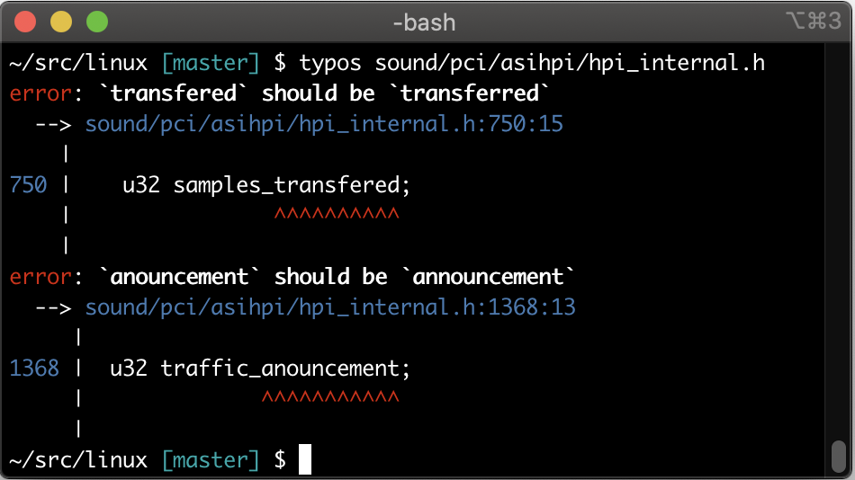
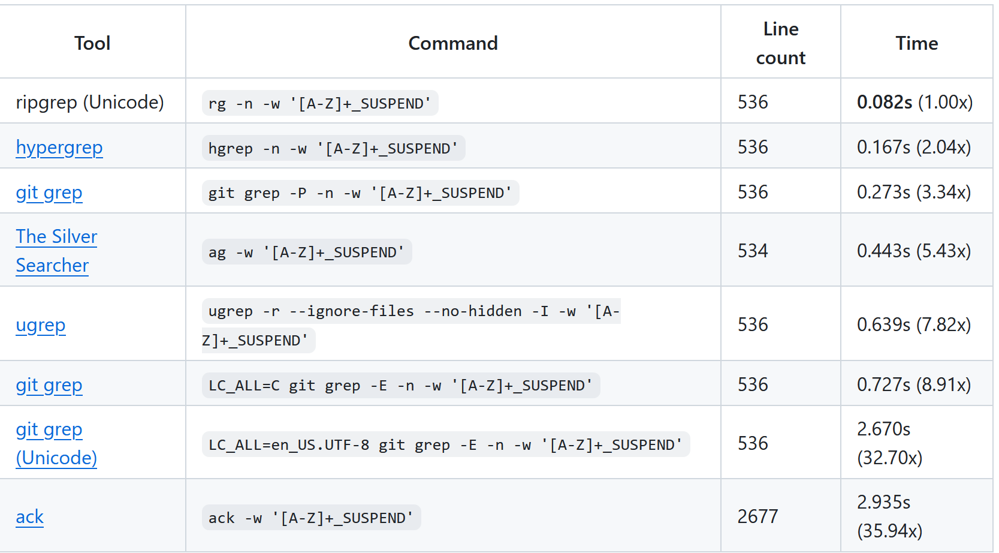
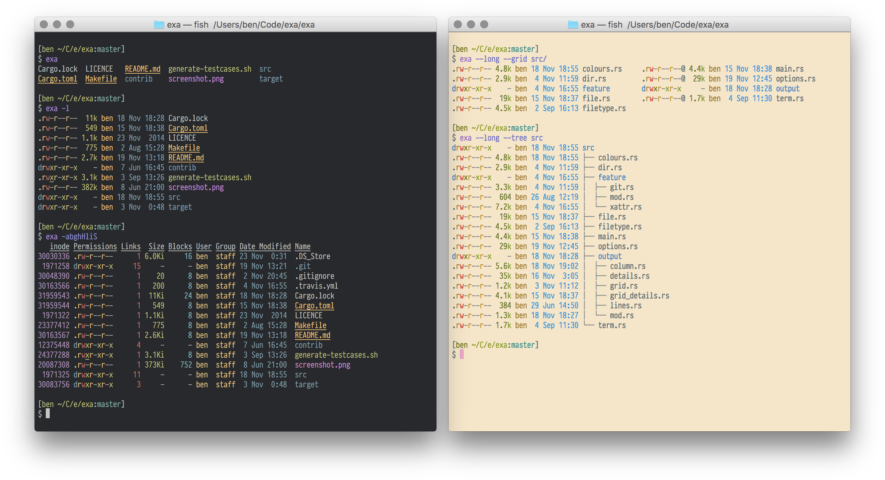
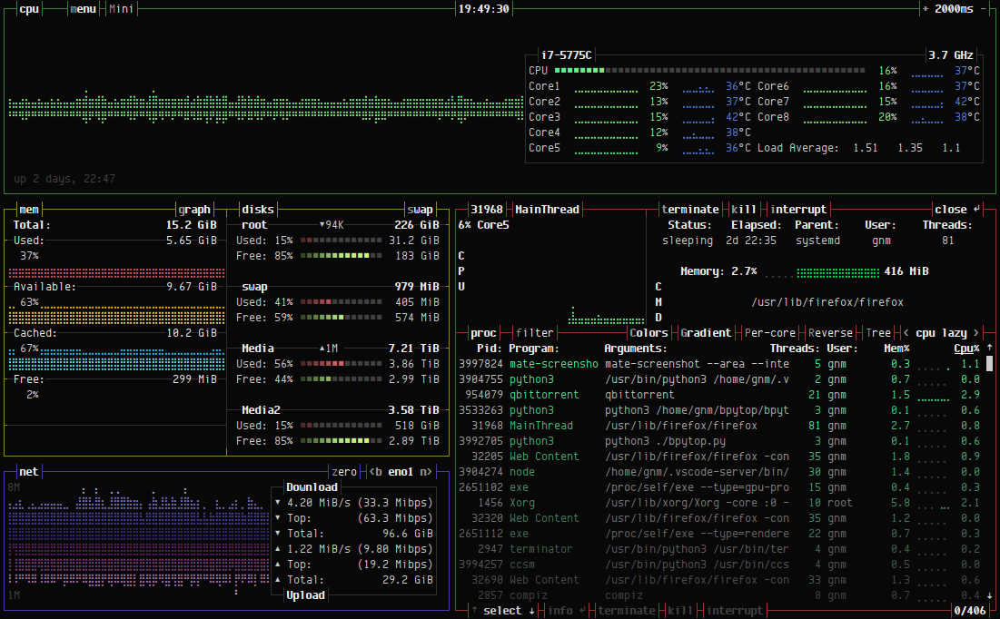
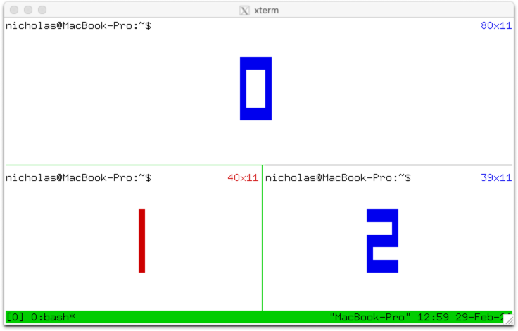
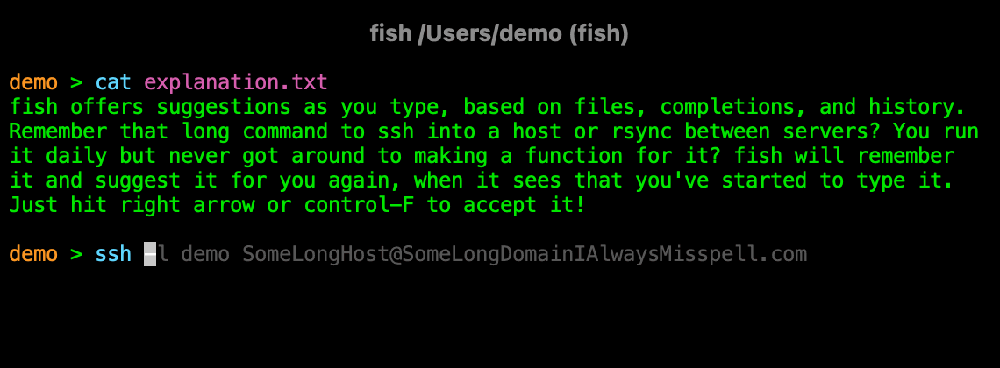

# 简介

个人常用命令行工具集

## 速决之

在新的Unix系统（主要是Ubuntu和OSX）的电脑，运行如下命令

```sh
git clone https://gitee.com/deelin-zzl/dotfiles.git
cd dotfiles
./stow.sh
./setup.py
```

不需要科学上网。但是，由于要联网下载安装一堆工具，如果网络太慢会失败。

没错，就是这么可恶。这样的话，只能手动重复执行相关的下载安装命令，知道下载安装完成。

如果试了好几次还是不行，换个网络或者换个时段吧，我这边的网络深夜十点以后就跟断网了一样，死活连不上。

```sh
/path/to/mamba -p /path/to/mamba python update_tools.py all
```

如果网络不太拉跨，一个爽歪歪的终端开发环境就完成了！

打开一个新的终端，输入`mamba3/bin/fish`，回车开始体验！

默认的终端不会是fish，必须自己手动设置，不然下次使用还是需要手动切换到fish才行：

```sh
sudo vi /etc/shells
# 把 /path/to/mamba3/bin/fish 加到最后一行
# 必须是绝对路径
chsh -s /path/to/mamba3/bin/fish
```

退出后重新登录，大功告成，我的朋友！

## 里面到底有什么好东西？

### python 相关

- [pip-autoremove](https://pypi.org/project/pip-autoremove/)

一次性卸载和删除pip安装的包和它的没有被别的包使用着的依赖。

```shell
$ pip-autoremove Flask -y

Flask 0.10.1 (/tmp/pip-autoremove/.venv/lib/python2.7/site-packages)
    Werkzeug 0.9.6 (/tmp/pip-autoremove/.venv/lib/python2.7/site-packages)
    Jinja2 2.7.3 (/tmp/pip-autoremove/.venv/lib/python2.7/site-packages)
        MarkupSafe 0.23 (/tmp/pip-autoremove/.venv/lib/python2.7/site-packages)
    itsdangerous 0.24 (/tmp/pip-autoremove/.venv/lib/python2.7/site-packages)

Uninstalling MarkupSafe:
  Successfully uninstalled MarkupSafe
Uninstalling Jinja2:
  Successfully uninstalled Jinja2
Uninstalling itsdangerous:
  Successfully uninstalled itsdangerous
Uninstalling Werkzeug:
  Successfully uninstalled Werkzeug
Uninstalling Flask:
  Successfully uninstalled Flask
```

- [pipdeptree](https://pypi.org/project/pipdeptree/)

展示当前环境的包依赖关系。

```shell
$ pipdeptree
Warning!!! Possibly conflicting dependencies found:
* Jinja2==2.11.2
 - MarkupSafe [required: >=0.23, installed: 0.22]
------------------------------------------------------------------------
Flask==0.10.1
  - itsdangerous [required: >=0.21, installed: 0.24]
  - Jinja2 [required: >=2.4, installed: 2.11.2]
    - MarkupSafe [required: >=0.23, installed: 0.22]
  - Werkzeug [required: >=0.7, installed: 0.11.2]
Lookupy==0.1
pipdeptree==2.0.0b1
  - pip [required: >=6.0.0, installed: 20.1.1]
setuptools==47.1.1
wheel==0.34.2
```

### rust 开发的一些工具，速度超快

- [typos](https://github.com/crate-ci/typos)

检查常见单词拼写错误，对于减少一些低级错误很有帮助，也会有些误报，需要自己手动设置规则




- [ripgrep](https://github.com/BurntSushi/ripgrep)

grep或awk的强化版，用于从文本文件中正则匹配特定内容。



- [bat](https://github.com/sharkdp/bat)

cat 的强化版，自动显示行号，内容过多时启用less分页显示，而且支持git标记


- [zoxide](https://github.com/ajeetdsouza/zoxide)

cd 的强化版，自动记录访问过的目录，支持模糊匹配，支持目录的权重排序


- [fd](https://github.com/sharkdp/fd)

find 的强化版，用于查找文件


- [exa](https://github.com/ogham/exa)

ls 的强化版，用于显示文件列表



- [tokei](https://github.com/XAMPPRocky/tokei)

统计当前路径下各种编程语言的代码行数占比

```sh
━━━━━━━━━━━━━━━━━━━━━━━━━━━━━━━━━━━━━━━━━━━━━━━━━━━━━━━━━━━━━━━━━━━━━━━━━━━━━━━
 Language            Files        Lines         Code     Comments       Blanks
━━━━━━━━━━━━━━━━━━━━━━━━━━━━━━━━━━━━━━━━━━━━━━━━━━━━━━━━━━━━━━━━━━━━━━━━━━━━━━━
 BASH                    4           49           30           10            9
 JSON                    1         1332         1332            0            0
 Shell                   1           49           38            1           10
 TOML                    2           77           64            4            9
───────────────────────────────────────────────────────────────────────────────
 Markdown                5         1355            0         1074          281
 |- JSON                 1           41           41            0            0
 |- Rust                 2           53           42            6            5
 |- Shell                1           22           18            0            4
 (Total)                           1471          101         1080          290
───────────────────────────────────────────────────────────────────────────────
 Rust                   19         3416         2840          116          460
 |- Markdown            12          351            5          295           51
 (Total)                           3767         2845          411          511
━━━━━━━━━━━━━━━━━━━━━━━━━━━━━━━━━━━━━━━━━━━━━━━━━━━━━━━━━━━━━━━━━━━━━━━━━━━━━━━
 Total                  32         6745         4410         1506          829
━━━━━━━━━━━━━━━━━━━━━━━━━━━━━━━━━━━━━━━━━━━━━━━━━━━━━━━━━━━━━━━━━━━━━━━━━━━━━━━
```

- [jless](https://github.com/PaulJuliusMartinez/jless)

命令行json内容查看器，交互方便


### 其他通用的

- [pre-commit](https://pre-commit.com/)

自动执行代码格式化等操作的钩子，在git开源社区非常流行。避免手动操作的时候忘了一些步骤，保证仓库的代码质量。

```shell
$ pre-commit run --all-files
[INFO] Initializing environment for https://github.com/pre-commit/pre-commit-hooks.
[INFO] Initializing environment for https://github.com/psf/black.
[INFO] Installing environment for https://github.com/pre-commit/pre-commit-hooks.
[INFO] Once installed this environment will be reused.
[INFO] This may take a few minutes...
[INFO] Installing environment for https://github.com/psf/black.
[INFO] Once installed this environment will be reused.
[INFO] This may take a few minutes...
Check Yaml...............................................................Passed
Fix End of Files.........................................................Passed
Trim Trailing Whitespace.................................................Failed
- hook id: trailing-whitespace
- exit code: 1


Files were modified by this hook. Additional output:


Fixing sample.py


black....................................................................Passed
```

- [asciinema](https://asciinema.org/)

命令行录制工具，可以录制终端的操作过程，生成文本文件或者gif文件，demo请移步其官网

- [magick](https://www.imagemagick.org/)

命令行处理图片的工具，可以进行图片格式转换，图片裁剪，图片合成等等


- [ffmpeg](https://ffmpeg.org/)

命令行处理视频的工具，可以进行视频格式转换，视频剪辑，视频合成等等

```sh
ffmpeg -i input.mp4 output.avi
```

- [bpytop]()

top, htop, btop 的强化版，用于查看系统资源占用情况



- [unzip](https://linux)

命令行解压缩工具，用于解压缩zip文件

```sh
unzip file.zip
```

- [nvim](https://neovim.io/)

vim 的强化版，编辑器之神，不亚于甚至强于 VSCode

- [node](https://nodejs.org/)

将JavaScript带入服务端的工具，用于开发前端和后端，很多命令行工具都依赖它

- [tmux](https://github.com/tmux/tmux)

终端多路复用器：它支持从单个屏幕创建、访问和控制多个终端。TMUX 可以从屏幕上分离并继续在后台运行，然后重新连接。



- [tldr](https://tldr.sh/)

新工具的帮助文档太长了，看得头疼？用tldr快速生成简述和可用示例

```sh
tldr cargo

  cargo

  Manage Rust projects and their module dependencies (crates).
  Some subcommands such as `build` have their own usage documentation.
  More information: https://doc.rust-lang.org/cargo.

  - Search for crates:
    cargo search search_string

  - Install a binary crate:
    cargo install crate_name

  - List installed binary crates:
    cargo install --list

  - Create a new binary or library Rust project in the specified directory (or the current working directory by default):
    cargo init --bin|lib path/to/directory

  - Add a dependency to `Cargo.toml` in the current directory:
    cargo add dependency

  - Build the Rust project in the current directory using the release profile:
    cargo build --release

  - Build the Rust project in the current directory using the nightly compiler (requires `rustup`):
    cargo +nightly build

  - Build using a specific number of threads (default is the number of logical CPUs):
    cargo build --jobs number_of_threads
```

- [ruff](https://github.com/astral-sh/ruff)

静态检查工具，代码质量排查与自动格式化，有了它就可以扔掉以前的那套工具链了，包括 flake8, black, isort, pydocstyle, pyupgrade, autoflake 等，而且速度超级快！


- [fish](https://github.com/fish-shell/fish-shell)

一个更加用户友好的shell，语法相比于bash或zsh略有不同，迁移时请慎重



- [starship](https://github.com/starship/starship)

命令行提示符主题，让单调的 shell 漂亮一点，不光是花哨，确实会显示很多有用的信息，比如git状态和常见工具版本号等，和 power10k 类似，但是响应更快


- [h5glance](https://github.com/European-XFEL/h5glance)

预览hdf5文件树，当报错某个数据不存在时用这个排查很方便

```sh
$ h5glance sample.h5
sample.h5
└path
  └inside
    └file   [float64: 100 × 100]
```
